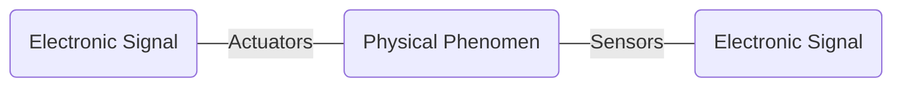

# Harmonisation Réseau et Sécurité - Cours 1
---

Lesson : 
- [[Summary - SI3 - Harmonisation Réseau et Sécurité|Harmonisation Réseau et Sécurité SI3]]
Tags : #network #security #SI3
Date : 2022-09-13

---
### Présentation rapide du modèle OSI

![[OSI Model#Definition]]

----
### Physical Layer (layer 1)

![[OSI - Layer 1 (Physical)#Definition]] ^364709

----
#### Analog communication

- Origin = the human body
	- speaking
	- hearing
- Sender -> Receiver
	- The arrow is in the transmission medium and represent the signal.
- The phone is one of the first mean of analog communication
	- Medium : copper cable
	- Analog signal

---
#### Discrete Communication
- Morse code

Modulation vs demodulation ?

---
#### Telecommunications

Telecommunications
- The electronic transmission of signals for communications, including such means as : 
	- Telephone
	- Radio
	- Television

---
#### Data Communications

- A specialized subset of telecommunications that refers to the electronic collection, processing, and distribution of -- typiccaly between computer system hardware devices.

---

![[OSI - Layer 1 (Physical)#Devices]]

---
#### Types of modulation techniques

- Amplitude modulation
	- Représentation d'un seul fil
- Frequency modulation
	- 10 fréquences = 10 fils

---
### Data Communication Management (layer 2)

![[OSI - Layer 2 (Data Link)#Definition]]

---

![[OSI - Layer 2 (Data Link)#How to distinguish consecutive frames]]

#### Shared medium and multiple connected devices

![[Carrier Sense Multiple Access (CSMA)#Definition]]

---
#### Who sent the frame ?

Dans la trame, à un endroit donné, il y a quelques bits qui vont encoder l'identifiant de la machine.

Format de la trame Ethernet V2

| 8         | 6                   | 6              | 2          | 46 à 1500 | 4   |
| --------- | ------------------- | -------------- | ---------- | --------- | --- |
| Préambule | Adresse Destination | Adresse Source | Ether Type | Données   | CRC    |

---
##### MAC Adress (IEEE 802.1)

> Media Access Control Address

- For :
	- Local Area Network (LAN, ex : Ethernet)
	- Wireless Local Area Network (WLAN, ex : Wifi, Lifi)
	- Personal Area Network (PAN, ex : Bluetooth)
	- Low Power Wide Area Network (LPWAN, ex: Lora, Sigfox, Zigbee)
- See ifconfig / ipconfigs commands

FORMAT :
00 1A 3F F1 4C C6
- Trois premiers : organizationnally unique identifier
- Trois autres : Network Interface Controller Specific

Hacking possible en utilisant l'adresse MAC de quelqu'un d'autre.

---
![[OSI - Layer 2 (Data Link)#Devices]]

---
### Internet (layer 3)
Internet  : The network of networks

Gateway : def wikipédia : dispositif permettant de relier deux réseaux distincts présentant une topologie différente.
Le gateway gère le passage.

Router reçoit une trame destiné à lui -> il vire tout ce qui ne concerne pas la donnée pour ensuite l'envoyer sur la bonne interface. Cette donnée, de proche en proche va attendre la destination qui est identifiée par l'adresse IP.

---
#### IP Paquet

Ce paquet est dans les données d'une tram.
- Adresse Source
- Adresse Destination

![[Pasted image 20220913110323.png | center | 400]]

Fields :
- TTL : Time To Live
	- Décrémenter à chaque fois qu'il passe par un routeur
	- Une fois à 0, le routeur s'envoie un paquet à lui même et dit à l'envoyeur que ça n'a pas marché (à vérifier...)

---
#### IPv4 Address Formats

- 32 bit global Internet Adress 
	- 4 octets
	- Il y a 2^32 adresses possibles
- Network part and host part

Pour simplifier le tout :
- Class A
- Class B
- Class C
- Class D
- Class E

![[Pasted image 20220913111731.png | center | 400]]

On réduit la taille de la table de routage en se concentrant que sur certains bits vraiment nécessaire. 
Voir [[Harmonisation Réseau et Sécurité SI3 - Cours 1#Network Masks]]

Partie réseau de l'IP ?

---
#### Network Masks

- Distinguishes which portion of the adress identifies the network and which portion of the adress identifies the node.
- Default masks : 
	- Class A : 255.0.0.0
	- Class B : 255.255.0.0
	- Clas C : 255.255.255.0

255.255.254.0 ???? PAS COMPRIS

Example : 
IP = 172.22.176.1
Masque de sous réseau : 255.255.240.0

Pour avoir le nombre de ??? il faut convertir 240 en binaire, 176 en binaire et ensuite faire un AND logique entre les deux.

Notation CIDR
Example : 
- 172.22.176.0/24

---
#### Netid, Hostid, Mask

![[Pasted image 20220913111759.png | center | 500]]

`route` permet d'avoir le table de route de l'ordinateur.
`nslookup` ??
`traceroute` ??

---
#### Comment fabriquer la trame ?

À rechercher sur Internet.

---
#### Hierarchical Organization of the IP adresses

To avoid combinatorial explosion in the routing table.

IANA : Gère toutes les IP
Ensuite elle délègue la gestion de certains IP à d'autres services.
Exemple : 155.143.xxx.xxx : toutes ces adresses sont gérées par quelqu'un

---
#### DNS

> DNS : Domain Name Server
> Help to associate names and IP adresses

![[Pasted image 20220913114114.png | center | 500]]

![[Pasted image 20220913114243.png | center | 400]]

### Introduction to Transport Protocols over IP : UDP / TCP (layer 4)

Adding buffers in the computers and corresponding port number to IP Address.

Communications endpoints are :
- IP_Src / Port Src
- IP_Dest / Port

![[Ports#Définition|Ports]]

---
#### UDP Datagram

> UDP : User Datagram Protocol

Typical Applications : 
- Where packet loss etc... is better handled by the application than the network stack
- Where the overhead of setting up a connection isn't wanted

- VOIP
- NFS - Network File System
- Most games

UDP = Protocole non robuste

---
#### TCP

Plus lourd mais beaucoup beaucoup mieux que UDP.

